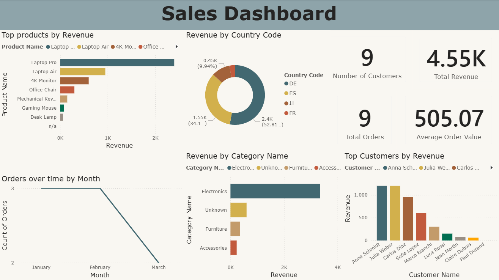

# Sales-Dashboard-Power-BI-Project
A Power BI project demonstrating the full data workflow: raw data cleaning in Power Query, dimensional data modeling (Star schema), and an interactive sales dashboard.



---

## 📌 Project Overview

This project starts from a single flat CSV file with intentionally messy, real-world-style data problems.
The goal was to clean it in Power Query, restructure it into a proper star schema, and build a dashboard to visualize sales performances.

**Tools used:** Power BI Desktop, Power Query

---

## 🧹 Raw Data & Data Cleaning

The source file `sales_flattable_raw.csv` is a flat sales table with `12 rows` and `10 columns`.

### Raw Data Issues

| Issue | Description |
| --- | --- |
| Inconsistent name casing | `#ANna ScHmidt`, `CARLOS DIAZ`, mixed upper/lower |
| `#` prefix in names | `#Jean`, `#Claire`, `#paul` - needed to be stripped |
| Mixed email casing | `ANNA@gmail.com`, `LUCA@email.com` |
| Combined column | `Product_Info` mixed product name and category (`Laptop Pro` | `ELEC`) |
| Embedded country code | `Customer_ID` contained country inside the ID (`C-1001-DE`) |
| Invalid date format | `Order_Date` had a `D` prefix (`D2024-01-05`), stores as text |
| Empty rows | 3 completely blank rows |
| Duplicate row | OrderID `1001` appeared twice |
| Missing values | `Amount` (1 row), `Price` (1 row), `Email` (1 row) |
| Invalid date | `D2024-99-13` - month 99 does not exist |
| Missing product data | 1 row with no product name, 1 row with no product category |

### Cleaning Steps Applied (Power Query)

#### Removed columns & rows

- Dropped `Technical_Log_ID` (irrelevant)
- Removed 3 empty rows
- Removed the duplicate order row

#### Name & email standardization

- Trimmed whitespace from first and last names
- Proper-cased first and last names
- Stripped `#` prefix from first names
- Trimmed and lowercased all email addresses

#### New columns added

- Split `Product_Info` into `Product_Name` and `Category`
- Split `Customer_ID` to extract `Country_Code` as a separate column
- Merged `First_Name` + `Last_Name` into a single `Customer_Name` column
- Extracted `Email_Domain` from the email address

#### Type & format fixes

- Stripped the `D` prefix from `Order_Date` and converted to proper date type
- Rounded `Amount` up to whole units
- Rounded `Price` to 2 decimal places
- Converted `Amount` from text to numeric

#### Null & error handling
- Replaced blank/null values with `null` where appropriate
- Replaced null `Price` with `0`
- Replaced transformation errors with `null`

#### Category enrichment

- Created a helper `Categories` table mapping short codes (`ELEC`, `ACC`, `FURN`) to full names (`Electronics`, `Accessories`, `Furniture`)
- Merged this table into the product data to add a `Category_Name` column

---

## 🏗️ Data Modeling (Star Schema)

The cleaned flat table was split into 3 tables following a star schema structure.

Since the original product data had no natural primary key, a surrogate `Product_Id` was generated from `Product_Name` and used to establish the relationship between `dim_products` and `fact_sales`.
```text
dim_products ──(1)────────(*)── fact_sales ──(*)────────(1)── dim_customers
```

### fact_sales(Fact Table)

Stores one row per order transaction.

| Column | Type |
| --- | --- |
| `Order_Id` | Whole Number |
| `Product_Id` | Whole Number (FK → dim_products) |
| `Customer_Id` | Text (FK → dim_customers) |
| `Order_Date` | Date |
| `Amount` | Whole Number |
| `Price` | Decimal |

### dim_products (Dimension Table)

One row per unique product

| Column | Type |
| --- | --- |
| `Product_Id` | Whole Number (PK - surrogate key) |
| `Product_Name` | Text |
| `Category` | Text |
| `Category_Name` | Text |

### dim_customers (Dimension Table)

One row per unique customer

| Column | Type |
| --- | --- |
| `Customer_Id` | Text (PK) |
| `Customer_Name` | Text |
| `Country_Code` | Text |
| `Email` | Text |
| `Email_Domain` | Text |

---

## 📊 Sales Dashboard

An interactive single-page dashboard with the following visuals:

| Visual | Type |
| --- | --- |
| Number of Customers | KPI Card |
| Total Revenue | KPI Card |
| Total Orders | KPI Card |
| Average Order Value | KPI Card |
| Top Products by Revenue | Horizontal Bar Chart |
| Revenue by Country Code | Donut Chart |
| Revenue by Category Name | Horizontal Bar Chart |
| Top Customers by Revenue | Vertical Bar Chart |
| Orders over Time by Month | Line Chart |

---

## 📂 Project Structure

```text
Sales-Dashboard-Power-BI-Project/
├── dataset/
│    └── sales_flattable_raw.csv
├── docs/
│    └── image/
│         └── sales_dashboard.png
├── report/
│    └── powerbi_project.pbix
│
└── README.md
```

---

## ⭐ Prerequisites

- **Power BI Desktop**

---

## 🛠️ How to Open

1. Download and install Power BI Desktop
2. Open `PowerBI_project.pbix`

---

## 👨‍💻 Author

**Václav Benda**


